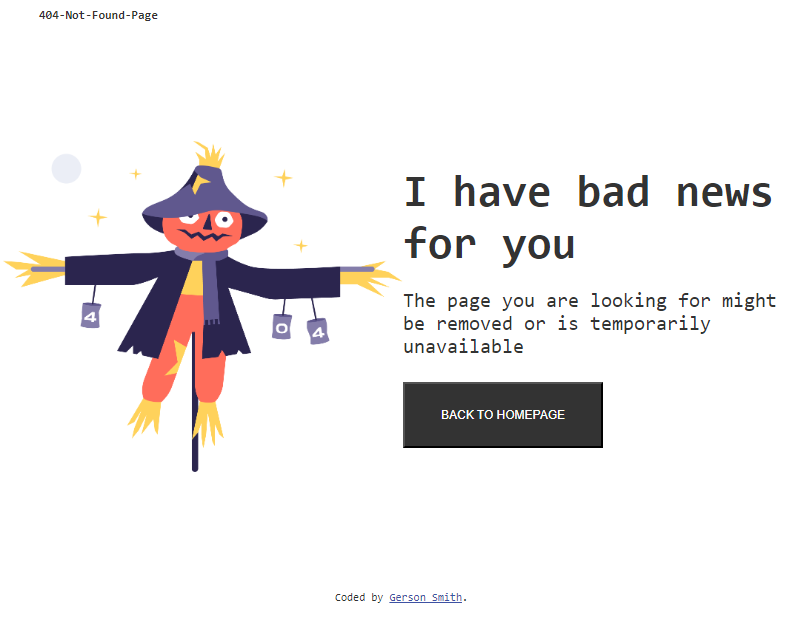
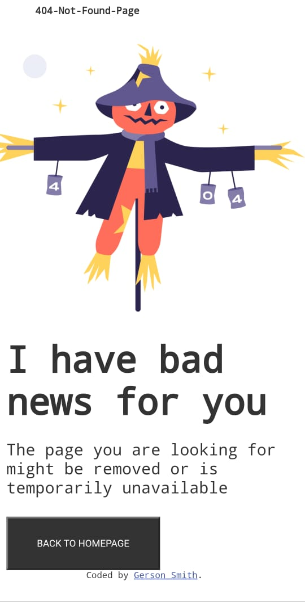

# Make It Real - NAME OF THE PROJECT

This is a solution for the 404 Not Found page implementation for the Gerson Camacho.


## Table of contents

- [Overview](#overview)
  - [The challenge](#the-challenge)
  - [Screenshot](#screenshot)
- [My process](#my-process)
  - [Built with](#built-with)
  - [What I learned](#what-i-learned)
  - [Continued development](#continued-development)
  - [Useful resources](#useful-resources)
- [Author](#author)
- [Acknowledgments](#acknowledgments)


## Overview

### The challenge

Users should be able to:

- Create the HTML structure
- Apply styling to the elements
- Implement media queries for different screen sizes

### Screenshot


&nbsp;

;


## My process

### Built with

- Semantic HTML5 markup
- CSS custom properties
- Flexbox
- Mobile-first workflow

### What I learned

### Major Learnings

One of the key takeaways from this project was learning how to use media queries to adjust styles for different screen sizes. For example, I learned how to implement responsive design using CSS media queries to ensure that elements are properly displayed on mobile screens.

Here is a code snippet highlighting how I used media queries:

```css
/* Adjustments for mobile screens */
@media (max-width: 375px) {
  .mirrow {
    display: flex;
    align-items: center;
    flex-direction: column;
    /* Aligns elements vertically in the center */
  }
}

```

If you want more help with writing markdown, we'd recommend checking out [The Markdown Guide](https://www.markdownguide.org/) to learn more.

### Continued development

Use this section to outline areas that you want to continue focusing on in future projects. These could be concepts you're still not completely comfortable with or techniques you found useful that you want to refine and perfect.

### Useful resources

- [Example resource 1](https://www.example.com) - This helped me for XYZ reason. I really liked this pattern and will use it going forward.
- [Example resource 2](https://www.example.com) - This is an amazing article which helped me finally understand XYZ. I'd recommend it to anyone still learning this concept.

## Author

- Website - [Add your name here](https://www.your-site.com)
- Twitter - [@yourusername](https://www.twitter.com/yourusername)


## Acknowledgments

This is where you can give a hat tip to anyone who helped you out on this project. Perhaps you worked in a team or got some inspiration from someone else's solution. This is the perfect place to give them some credit.
